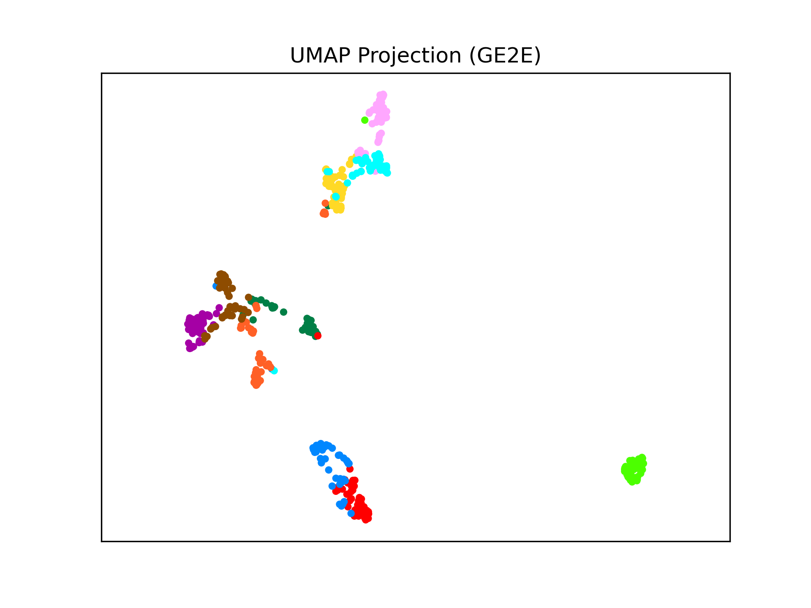
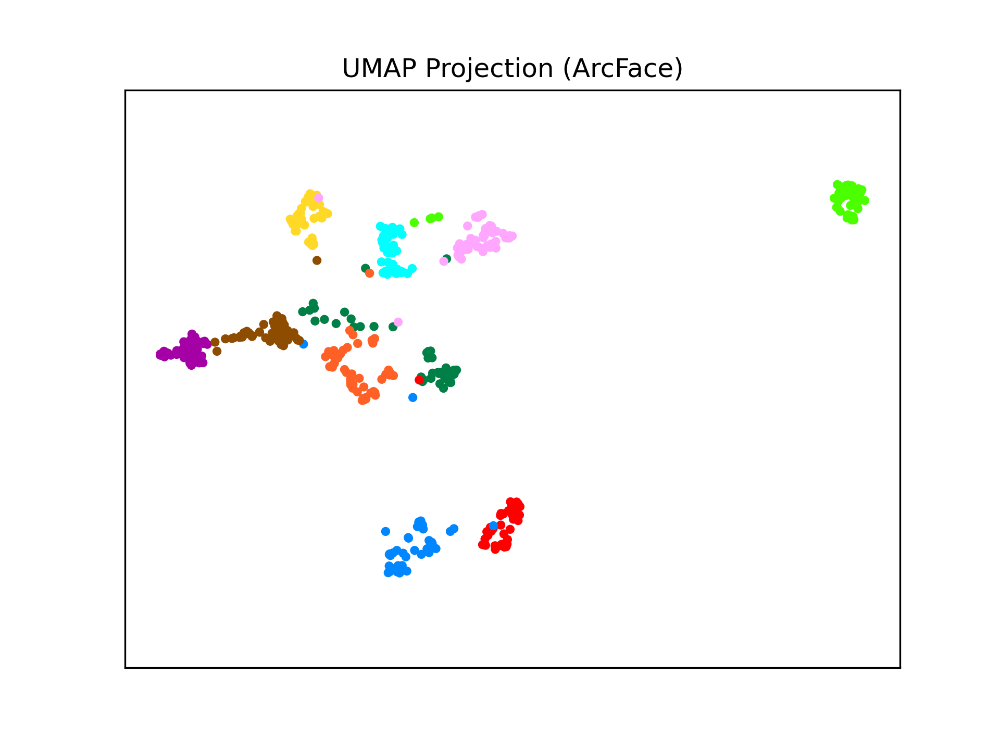
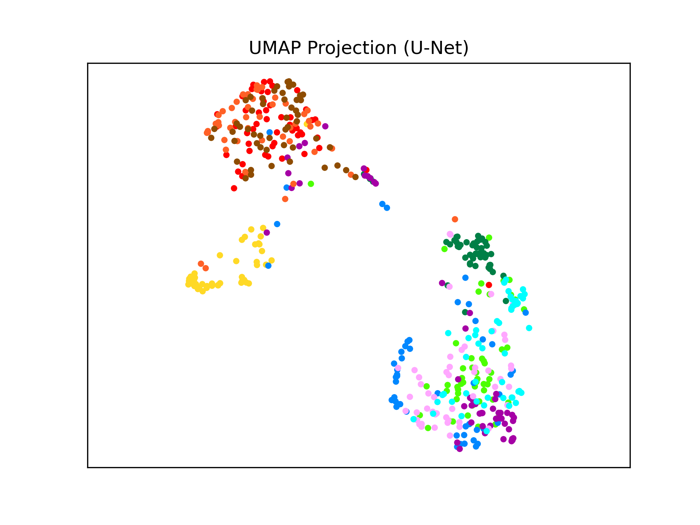

# landmark-retrieval
In this project, we extend two representation learning algorithms to perform image retrieval on Google Landmark Dataset v2. 

The first algorithm is inspired by [*Generalized End-to-End Loss for Speaker Verification (GE2E)*](https://arxiv.org/pdf/1710.10467.pdf), which was proposed to perform speaker verification by leveraging the centroids of the embedding vectors for different speakers to maximize intra-class compactness and inter-class discrepancy. 

The second algorithm, [*Additive Angular Margin Loss (ArcFace)*](https://arxiv.org/pdf/1801.07698.pdf), adds an angular margin to the angle between the features and target weights in each dimension of class, which modifies the cross entropy loss to achieve more distinguishable embeddings. 

To compare the two algorithms, we use the same ResNet-101 network pre-trained on ImageNet as the encoder before the representation learning stage. We also design a variant of U-Net as the baseline to learn low-dimensional embeddings during image reconstruction. As a result, ArcFace obtains a superior retrieval performance.

Please refer to the [final report](ImageRetrieval.pdf) for more details.

  
   
  

